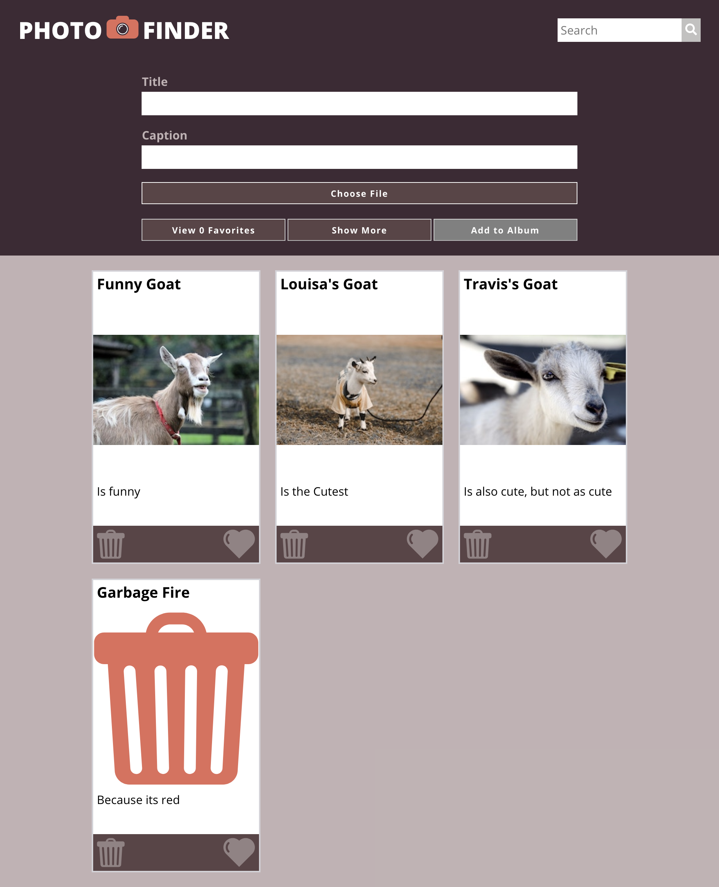
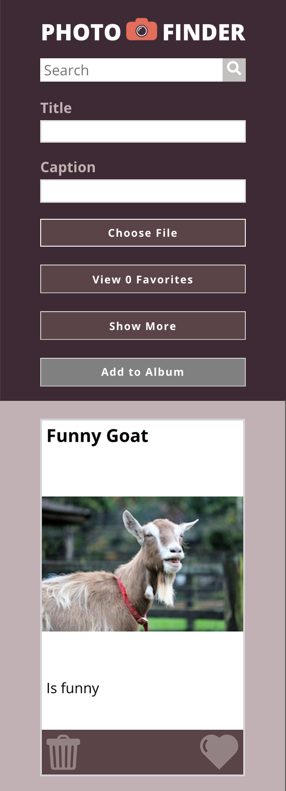

# Photo Finder

### By Devin Kapla

## A web-based application for saving photos with titles and captions.

## The Photo Finder app allows a user to keep track of their photos in several ways, differentiating them using titles, body content, and favorites. The photo cars are then saved to local storage which allows users to make adjustments at a later time if/when they update their photos. Users are able to sort their ideas based on favorites and can use the search feature to find photos based on title and body content as well.

### Built With
HTML
CSS
Javascript

### Build status
- Phase 1, 2, and 3 Complete

### First Update
- Update image functionality 
- Refactor into single action functions
- User testing/bug fixes
- Adjust card size for a common photo size 
- Add animations

## Current look/Usage example

### Mobile

## Original/provided Comp

